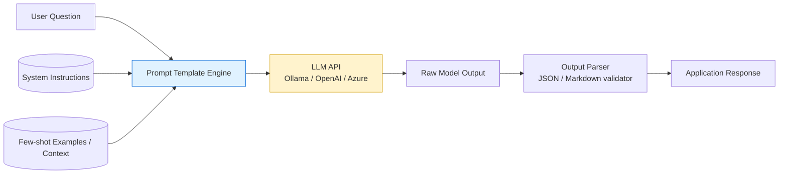

# Prompt Engineering

## What it is

Prompt engineering is the discipline of designing the input (the "prompt") sent to a
Large Language Model so that it reliably produces the output you want — without changing
the model's weights. It's the cheapest and fastest lever you have to control LLM behavior,
before you reach for RAG or fine-tuning.

A prompt is made of one or more of these building blocks:

- **System instruction** — sets the role, tone, and hard constraints ("You are a support
  agent. Never reveal internal pricing.").
- **Context** — background facts, documents, or conversation history.
- **Task / instruction** — what to actually do ("Summarize this in 3 bullet points").
- **Examples (few-shot)** — sample input/output pairs that demonstrate the expected format.
- **Output format constraint** — JSON schema, markdown table, word limit, etc.

## Core techniques

| Technique | Idea | When to use |
|---|---|---|
| Zero-shot | Just ask directly | Simple, well-known tasks |
| Few-shot | Give 2-5 examples in the prompt | Task needs a specific format/style |
| Chain-of-Thought (CoT) | Ask the model to "think step by step" | Math, logic, multi-step reasoning |
| Role prompting | "You are a senior security auditor..." | Steer tone/expertise |
| Self-consistency | Sample multiple CoT answers, take majority vote | High-stakes reasoning tasks |
| ReAct (Reason+Act) | Interleave reasoning with tool calls | Agentic workflows |

## Architecture diagram



See [images/prompt-engineering.mmd](images/prompt-engineering.mmd) for the diagram source.

## Real-world scenario

**Scenario: Customer support ticket triage**

A SaaS company receives thousands of support tickets a day. They want an LLM to classify
each ticket into `billing`, `bug`, `feature-request`, or `other`, and extract the urgency.

Without prompt engineering, a naive prompt like *"What category is this?"* gives
inconsistent, free-text answers that are hard to parse programmatically.

With prompt engineering:

```text
SYSTEM: You are a ticket classification engine. Always reply with strict JSON:
{"category": "billing|bug|feature-request|other", "urgency": "low|medium|high"}
No prose, no explanation.

FEW-SHOT EXAMPLE:
Ticket: "I was charged twice this month!"
Output: {"category": "billing", "urgency": "high"}

USER TICKET: "{{incoming_ticket_text}}"
```

Result: deterministic, machine-parsable JSON every time, which the backend can route
automatically to the right team — no fine-tuning or extra infrastructure required.
