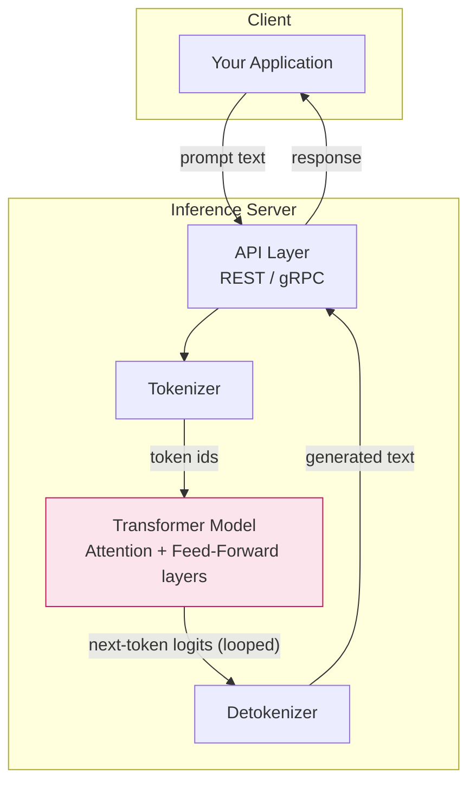

# LLM (Large Language Model)

## What it is

An LLM is a neural network — almost always a **Transformer** — trained on massive amounts
of text to predict the next token in a sequence. Scale that simple objective up to billions
of parameters and trillions of training tokens, and the model develops broad capabilities:
writing, reasoning, coding, translation, summarization, and more, all from a single
next-token-prediction objective.

## Key concepts

- **Tokens** — text is split into sub-word units (tokens). Models think and are billed in
  tokens, not words or characters.
- **Context window** — the maximum number of tokens (input + output) the model can attend
  to at once (e.g. 8K, 32K, 128K+ tokens).
- **Parameters** — the learned weights of the network (e.g. 3B, 7B, 70B). Roughly
  correlates with capability and required compute/memory.
- **Inference vs. training** — training builds the model (extremely expensive, done once
  by a lab); inference is just running the trained model to generate output (what you do
  every time you call it).
- **Temperature / top-p** — sampling parameters that control randomness/creativity of the
  output.
- **Alignment** — additional training (RLHF/DPO/instruction tuning) that makes a raw
  base model into a helpful, safe assistant.

## Architecture diagram

See [images/llm-architecture.mmd](images/llm-architecture.mmd) for the diagram source.

## Real-world scenario

**Scenario: Internal knowledge assistant for engineers**

A company runs Ollama in Docker on an internal server and exposes a `/ask` FastAPI
endpoint (like the `demo1-fastapi-ollama-chat` project in this workspace). Engineers ask
questions like "How do I revert a Kubernetes deployment?" and get instant, natural-language
answers — instead of digging through wikis.

Here, the LLM itself is the core engine: no external documents are injected (that would be
RAG) and no custom training happened (that would be fine-tuning). It's the model's
pre-trained general knowledge, accessed purely through prompting, doing the work.
