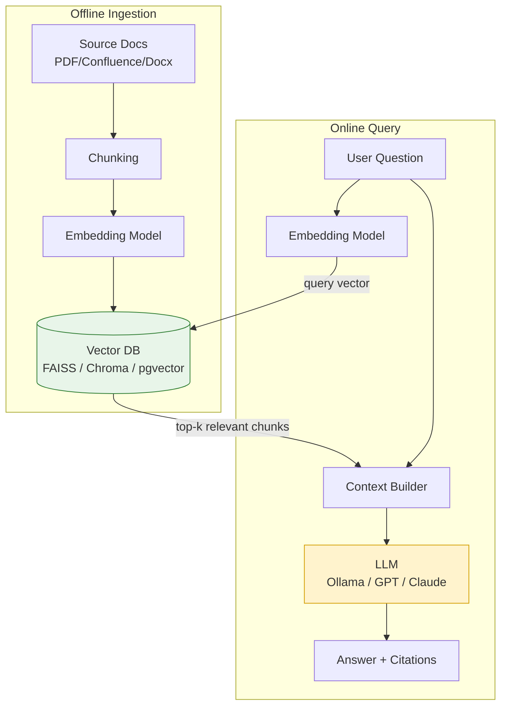

# RAG (Retrieval-Augmented Generation)

## What it is

RAG combines an LLM with an external, searchable knowledge base so the model can answer
using up-to-date or private information it was never trained on — without retraining it.
At query time, relevant document chunks are **retrieved** and injected into the prompt as
context, then the LLM **generates** an answer grounded in that context.

RAG solves two core LLM limitations:

1. **Knowledge cutoff** — the model doesn't know about your private data or recent events.
2. **Hallucination** — without grounding, models can confidently invent facts.

## How it works, step by step

1. **Ingest**: split documents into chunks, convert each chunk into a vector (embedding).
2. **Index**: store vectors in a vector database (e.g. FAISS, Chroma, pgvector, Azure AI
   Search).
3. **Retrieve**: embed the user's question, do a similarity search to find the top-k most
   relevant chunks.
4. **Augment**: insert those chunks into the LLM prompt as context.
5. **Generate**: the LLM answers using the retrieved context, ideally citing sources.

## Architecture diagram

See [images/rag-architecture.mmd](images/rag-architecture.mmd) for the diagram source.

## Real-world scenario

**Scenario: HR policy chatbot**

A company has 300 pages of HR policy documents (leave policy, expense rules, benefits).
Employees ask things like "How many sick days do I get in my first year?"

Without RAG, an LLM either says "I don't know" or hallucinates a plausible-sounding but
wrong policy number.

With RAG:

1. All HR PDFs are chunked and embedded once into a vector DB.
2. When an employee asks the question, the system embeds it, retrieves the 3 most relevant
   policy paragraphs (e.g., from `leave-policy.pdf`, page 4).
3. Those paragraphs are inserted into the prompt: *"Using only the following policy text,
   answer the question and cite the section..."*
4. The LLM answers accurately, grounded in the real, current policy — and can say
   *"According to Leave Policy §2.3, ..."*

If the policy changes next quarter, you just re-index the updated PDF — no retraining
needed.
