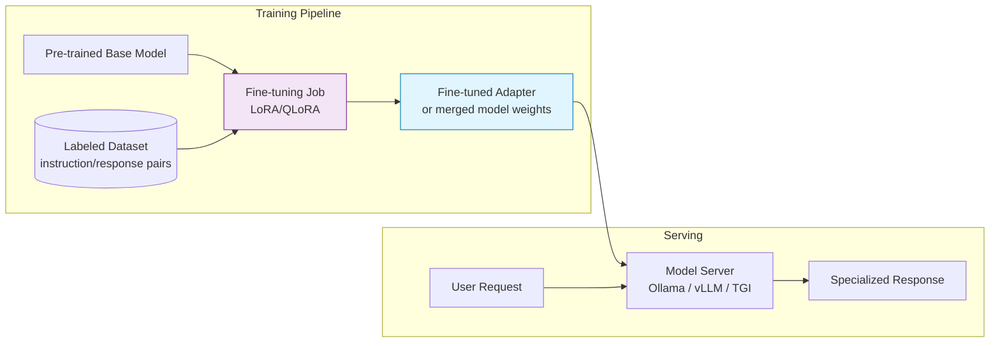

# Fine-tuning

## What it is

Fine-tuning takes a pre-trained LLM and continues training it on a smaller, task-specific
dataset, updating the model's weights. Unlike prompting or RAG, the knowledge/behavior is
baked directly into the model itself — nothing needs to be injected at inference time.

Use fine-tuning when prompting and RAG hit their limits: you need consistent **style/tone**,
a very specific **output format** the model keeps getting wrong, domain **jargon** it
doesn't understand, or you want to **shrink** a big general model into a small specialized
one that's cheaper/faster to run.

## Common approaches

| Approach | Idea | Cost |
|---|---|---|
| Full fine-tuning | Update all model weights | Very high (needs big GPU clusters) |
| LoRA / QLoRA | Freeze base weights, train small low-rank adapter matrices | Low — feasible on a single GPU |
| Instruction fine-tuning | Train on (instruction, response) pairs | Medium |
| RLHF / DPO | Train using human preference data to align behavior | High, needs preference data |

LoRA/QLoRA is the most common approach today because it's cheap, fast, and the adapters
are tiny (a few MB) and swappable per task.

## When NOT to fine-tune

- If better prompting or RAG already solves the problem — always try those first, they're
  much cheaper.
- If your data changes frequently — RAG handles freshness far better than retraining.

## Architecture diagram

See [images/fine-tuning-architecture.mmd](images/fine-tuning-architecture.mmd) for the
diagram source.

## Real-world scenario

**Scenario: Legal contract clause extractor**

A legal-tech startup needs a model that always outputs clause extractions in an exact,
strict JSON schema (`{"clause_type": ..., "risk_level": ..., "text": ...}`) across
thousands of contract types, with very domain-specific legal terminology.

Pure prompting got ~80% schema compliance and sometimes missed legal jargon nuances. RAG
helped ground facts but didn't fix formatting consistency.

They fine-tuned a 7B open-weight model using LoRA on 5,000 examples of
(contract clause → correct JSON extraction) pairs. Result: 99% schema compliance, faster
and cheaper inference (small model, no long few-shot examples needed every call), and
better handling of legal terms baked into the weights.
