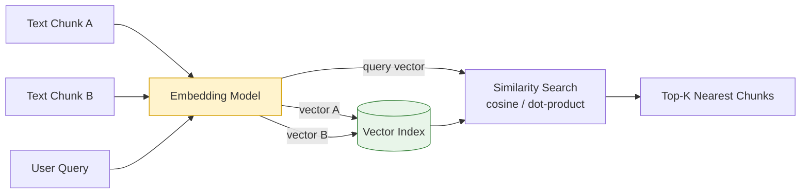

# Embeddings

## What it is

An embedding is a fixed-length vector of numbers (e.g. 384, 768, or 1536 floats) that
represents the *meaning* of a piece of text (or image/audio) in high-dimensional space.
Texts with similar meaning end up close together in that space, even if they share no
exact words — "car" and "automobile" land near each other; "car" and "banana" don't.

Embeddings are the foundation that makes **semantic search**, **RAG retrieval**,
**clustering**, **recommendation**, and **duplicate detection** possible.

## How similarity is measured

Given two embedding vectors, similarity is typically computed with:

- **Cosine similarity** — angle between vectors (most common; ignores magnitude).
- **Dot product** — used by some models trained specifically for it.
- **Euclidean distance** — straight-line distance.

## Key properties

- Produced by a dedicated embedding model (e.g. `nomic-embed-text`, `text-embedding-3-small`,
  `all-MiniLM-L6-v2`) — usually smaller/cheaper/faster than a full chat LLM.
- Deterministic: the same input text always produces the same vector (for a given model
  version).
- Dimensionality is fixed per model and matters for storage/index size trade-offs.

## Architecture diagram

See [images/embeddings-architecture.mmd](images/embeddings-architecture.mmd) for the
diagram source.

## Real-world scenario

**Scenario: "Find similar support tickets" feature**

A support platform wants to show agents "5 similar past tickets" whenever a new ticket
comes in, so agents can reuse previous solutions instead of solving from scratch.

Implementation:

1. Every resolved ticket's text is embedded once and stored in a vector index alongside its
   resolution notes.
2. When a new ticket arrives, it's embedded on the fly.
3. A cosine-similarity search against the index returns the 5 closest past tickets —
   even if they use completely different wording ("app crashes on login" vs. "cannot sign
   in, error 500").
4. The agent sees the matched resolutions instantly, cutting average resolution time
   significantly.

This is exactly the same retrieval mechanism that powers RAG — embeddings are the piece
that makes "search by meaning" possible.
