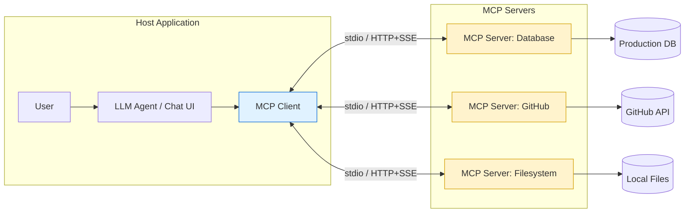

# MCP Server (Model Context Protocol)

## What it is

MCP (Model Context Protocol) is an open standard (introduced by Anthropic) that defines a
uniform way for LLM applications ("hosts", e.g. an IDE agent or chat app) to connect to
external **tools, data sources, and prompts** through a common client-server protocol —
instead of every app writing custom, one-off integration code for every tool.

Think of it as **"USB-C for AI apps"**: any MCP-compliant client can talk to any
MCP-compliant server without bespoke glue code.

## Core pieces

- **MCP Host** — the AI application the user interacts with (e.g. VS Code Copilot Chat).
- **MCP Client** — lives inside the host, manages a 1:1 connection to an MCP server.
- **MCP Server** — a lightweight process that exposes capabilities:
  - **Tools** — functions the model can call (e.g. `run_sql_query`, `create_jira_ticket`).
  - **Resources** — data the model can read (files, DB rows, API responses).
  - **Prompts** — reusable prompt templates the server provides.
- **Transport** — communication channel: `stdio` (local process) or HTTP/SSE (remote).

## Why it matters

Before MCP, connecting an LLM agent to N tools meant writing N custom integrations. With
MCP, you write **one server per tool/system**, and any MCP-aware host can use it —
integrations become reusable across every AI app, not just one.

## Architecture diagram

See [images/mcp-server-architecture.mmd](images/mcp-server-architecture.mmd) for the
diagram source.

## Real-world scenario

**Scenario: "Ask my database in plain English" via an AI coding assistant**

A developer wants to ask their AI assistant, *"How many orders were placed last week with
status 'failed'?"* directly from their editor, without writing SQL by hand.

1. A **Postgres MCP server** is set up, exposing a `run_query` tool (read-only) and a
   `list_tables` resource describing the schema.
2. The developer's AI host (e.g. VS Code chat) connects to this MCP server as a client.
3. The LLM agent sees the available `run_query` tool, generates the correct SQL
   (`SELECT COUNT(*) FROM orders WHERE status='failed' AND created_at > now() - interval '7 days'`),
   and calls the tool through MCP.
4. The MCP server executes the query against the real DB and returns rows back to the
   agent, which turns them into a natural-language answer for the developer.

The same MCP server can now be reused, unchanged, by any other MCP-compatible AI tool the
team adopts later — no re-integration needed.
